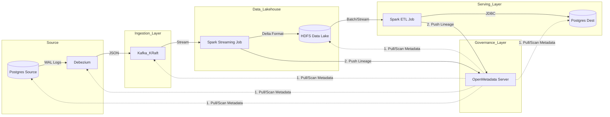
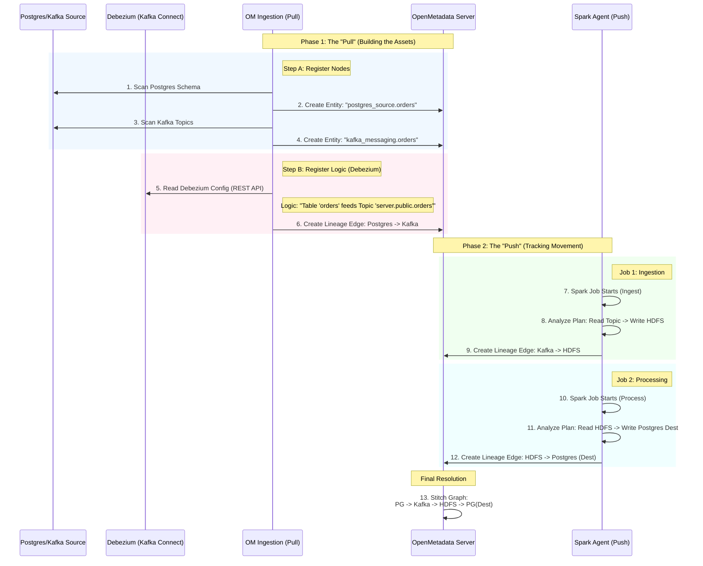

# End-to-End Big Data Pipeline with Governance 
(CDC -> Spark -> HDFS/Delta -> OpenMetadata)

## 📖 Overview

This project implements a production-grade **Modern Data Pipeline** on a local Docker environment. It demonstrates a complete Lambda/Kappa architecture flow: capturing real-time changes from a transactional database, streaming them through a message bus, ingesting them into a Data Lakehouse (Delta Lake), processing them with Spark, and serving them in an analytical database—all while maintaining full observability and lineage tracking via OpenMetadata.

## Key Features

- **Change Data Capture (CDC):** Zero-latency data ingestion using Debezium. 

- **Decoupled Architecture:** Storage (HDFS) and Compute (Spark) are separated. 

- **ACID Transactions on Data Lake:** Uses Delta Lake for reliability and time-travel.

- **Governance-First:** Automatic lineage extraction and metadata management.

- **Zookeeper-less Kafka:** Modern KRaft mode implementation.

- **Auto-Healing:** Container health checks and wait-strategies for robust startup.

## 🏗️ 1. Detailed Architecture

The system is composed of six distinct layers, orchestrating data flow from `OLTP` to `OLAP`.

**Data Flow Diagram**


**Component Breakdown**

1. **PostgreSQL (Source - OLTP):**
- **Role:** Simulates the production transactional database.
- **Config:** wal_level=logical is enabled to allow replication slots for CDC.
2. **Debezium (Connect):**
- **Role:** Acts as the bridge between Database and Kafka.
- **Mechanism:** Reads the Write-Ahead Log (WAL) of Postgres and converts row-level changes (INSERT/UPDATE/DELETE) into Kafka messages.

3. **Apache Kafka (Message Bus):**
- **Role:** Buffers streaming data.
- **Mode:** Running in KRaft mode, eliminating the need for Zookeeper, reducing infrastructure footprint.

4. **Apache Spark (Compute Engine):**
- **Role:** The heavy lifter for data processing.
- **Job 1 (Ingest):** A Structured Streaming job that consumes Kafka and writes to HDFS in Delta Lake format (Bronze Layer).
- **Job 2 (Process):** A Batch/Micro-batch job that reads Delta tables, applies transformations, and upserts data to the Destination Postgres (Gold Layer).
- **Integration:** Running with the OpenMetadataSparkListener to emit lineage events.

5. **HDFS (Storage Layer):**
- **Role:** Distributed file system acting as the Data Lake.
- **Format:** Data is stored as Delta Lake (Parquet + Transaction Logs) to ensure ACID compliance and schema enforcement.

6. **OpenMetadata (Governance):**
- **Role:** Centralized metadata repository.
- **Function:** Visualizes data lineage, catalogs tables, and tracks data movement end-to-end.

## ⚙️ 2. Prerequisites & System Requirements

This stack involves running 10+ heavyweight Java-based containers. Please ensure your host machine meets these requirements.

**Hardware**

- **RAM:** 16GB (Strongly Recommended) | 12GB (Minimum - may experience OOM kills).
- **CPU:** 4 Cores+.
- **Disk Space:** 30GB+ free space for Docker images and HDFS volumes.

**Software**

- **OS:** Linux (Ubuntu/CentOS), macOS, or Windows (via WSL2).
- **Docker Engine:** v20.10+.
- **Docker Compose:** v2.x+.
- **Git:** To clone the repository.
- **Docker Desktop Settings (Windows/Mac):**
    + `Memory`: Set to at least 8GB.
    + `Swap`: Enable 2GB-4GB swap if physical RAM is tight.
    
## 📂 3. Project Structure Guide

Understanding the directory layout is crucial for customization and debugging.
```bash
.
├── docker-compose.yml           # The "Brain" of the operation. Defines services, networks, volumes.
├── .env                         # Environment config (Secrets, Versions, Ports).
├── spark/                       # Spark Configuration & Code.
│   ├── Dockerfile               # Installs dependencies (Delta, Postgres, OM Agent) into the image.
│   ├── scripts/
│   │   └── get_om_token.sh      # Script to auto-fetch JWT token.
│   ├── conf/
│   │   ├── spark-defaults.conf  # Global Spark configs (Metastore, Listener).
│   │   └── hive-site.xml        # Hadoop/Hive connectivity configs.
│   └── jobs/                    # [USER CODE] Your PySpark ETL Logic.
│       ├── job1_ingest.py       # Logic: Kafka -> Spark -> HDFS (Delta). (Transfer from Bronze layer to Silver layer)
│       └── job2_process.py      # Logic: HDFS (Delta) -> Spark -> Postgres. (Transfer from Silver layer to Gold layer)
├── postgresql/                  # Database Initialization.
│   ├── init_source.sql          # Creates tables in Source DB. (Bronze layer in medallion database design)
│   ├── create_publication.sql   # Enables logical replication on Source DB.
│   └── init_dest.sql            # Creates tables in Dest DB. (Gold layer in medallion database design)
├── debezium/                    # CDC Configuration.
│   └── register-postgres.json   # JSON payload to configure the Connector via REST API.
├── hive-metastore/              # Metadata Catalog for HDFS/Spark.
│   ├── Dockerfile               # Custom image for HMS.
│   └── conf/
│       └── hive-site.xml        # HMS configuration. (use PostgreSQL as a backend database instead of embedded database)
└── data_generator/              # Simulation Tool.
    ├── Dockerfile               # Python environment.
    ├── make_data.py             # Script to generate data every 5s.
    └── requirements.txt         # Python libs (faker, psycopg2, etc).

```

## 🚀 4. Comprehensive Deployment Guide

**Phase 1: Infrastructure Setup**

1. **Clone and Build**

Start the entire stack. This command will build the custom Spark and Data Generator images locally.

```bash
# Start in detached mode and force build of custom images
docker-compose up -d --build
```

2. **Verify Container Health**

Ensure all critical services are `healthy` or `running`.

```bash
docker ps --format "table {{.Names}}\t{{.Status}}\t{{.Ports}}"
```

Wait until `dp_om_server` and `dp_kafka` report as *healthy* (*approx*. 5-10 mins).

**Phase 2: Metadata Ingestion**

While the Spark Agent creates lineage automatically, explicitly ingesting metadata for your Databases and Messaging services first ensures richer, more accurate lineage graphs.

*Note: The system is designed to automatically fetch tokens via the `get_om_token.sh` script during container startup. However, we have provided the **Manual Token Configuration** steps below as a **Fallback Option** in case the automation fails or you prefer manual control.*

1. **Access UI:** Open OM server: http://localhost:8585 (User: `admin` / Pass: `admin`).

2. **Configure OpenMetadata (Security Handshake - Fallback Option)**
Perform this step ONLY if the auto-auth script fails.

Spark needs permission to push metadata to OpenMetadata.

- In OM UI, navigate: **Settings** (Gear Icon) -> **Bots** -> **Ingestion Bot**.

- Click **Revoke Token** (if active) then **Create Token**.

- Name it `spark-pipeline` and set expiration to *"No Expiry"*.

- Copy the **JWT Token**.

- Paste it into your `.env` file (variable `OM_JWT_TOKEN`) or update `docker-compose.yml` environment variables.

3. **Ingest "Postgres Source" Metadata**

- In OM UI, go to **Services** -> **Databases** -> **Add New Service**.

- Select **Postgres**. Name it `postgres_source`.

- Connection:

    + Host: `postgres-source`

    + Port: `5432`

    + Username: `admin` / Password: `password`

    + Database: `jadc2_db`

- Click **Test Connection** -> **Save**.

- **Add Ingestion:** Schedule it to run *"Every hour" (or manually triggers)*. Click **Deploy & Run**.

4. **Ingest "Kafka" Metadata**

- Go to **Services** -> **Messaging** -> **Add New Service**.

- Select **Kafka**. Name it `kafka_messaging`.

- Connection:

    + Bootstrap Servers: `kafka:9092`

- Click **Test Connection** -> **Save**.

- **Add Ingestion:** Configure to filter topics if needed (e.g., `server.public.*`). Click **Deploy & Run**.

5. **Ingest "Kafka Connect" (Crucial for CDC Lineage)**

This step links Postgres Source to Kafka Topics.

- OM UI -> **Services** -> **Pipeline** -> **Add New Service**.

- Select **Kafka Connect**. Name: `debezium_cdc`.

- Connection: HostPort: http://debezium:8083.

- **Test Connection** -> **Save**.

- **Add Ingestion** -> **Deploy & Run**.

6. **Ingest "HDFS" Metadata (Storage Service)**

- Go to **Services** -> **Storage** -> **Add New Service**.

- Select **HDFS** (or Data Lake). Name it `hdfs_datalake`.

- Connection:

    + HostPort: `hdfs://namenode:9000`

- Click **Test Connection** -> **Save**.

- **Add Ingestion:** Leave defaults or point to specific paths. Click **Deploy & Run**.

*(Note: This step is crucial so the Spark Agent knows that paths starting with `hdfs://namenode:9000` belong to this specific service, preventing "orphan" lineage nodes.)*

7. **Ingest "Postgres Destination" Metadata**

- Go to **Services** -> **Databases** -> **Add New Service**.

- Select **Postgres**. Name it `postgres_dest`.

- Connection:

    + Host: `postgres-dest`

    + Port: `5432` (Note: internal port is `5432`, even though mapped to `5434` externally).

    + Username: `admin` / Password: `password`

    + Database: `jadc2_db`

- Click **Test Connection** -> **Save**.

- **Add Ingestion** -> **Deploy & Run**.

**Phase 3: Pipeline Activation**

1. **Start Spark Jobs**
If you updated the `.env` file with the Token after the containers started, restart the Spark jobs to apply the token:
```bash
docker-compose restart spark-job-ingest spark-job-process
```

Check logs to confirm auto-auth success: `docker logs dp_spark_ingest`

## 📊 5. The Data Journey (Verification)

Follow a single data point through the system to verify success.

**Step 1: Data Creation**

The `data-generator` creates a record in `postgres-source`.
- **Verification**: Check logs `docker logs -f dp_data_generator`.
- **SQL Check**: Connect to `localhost:5432` and `SELECT * FROM tableName;`

**Step 2: Ingestion (Kafka)**

Debezium captures the INSERT and sends it to Kafka topic `topicName`.
- **Verification**: Using Kafka UI or `kcat` or Spark logs to see incoming batches.

**Step 3: Storage (HDFS/Delta)**

`Spark Job 1` picks up the message and writes to HDFS.
- **UI Check**: Go to http://localhost:9870 (HDFS NameNode) -> Utilities -> Browse Directory -> `/data/delta/orders`.
- **Artifacts:** Look for `_delta_log` folder containing `.json` transaction files.

**Step 4: Serving (Postgres Dest)**

`Spark Job 2` reads the Delta table and writes to `postgres-dest`.
- **SQL Check**: Connect to `localhost:5434` and `SELECT * FROM tableName;`

**Step 5: Observability (OpenMetadata)**

- **UI Check:** Go to http://localhost:8585 (OM server).
- **Search:** `tableName`.
- **Lineage:** Verify the graph shows the complete flow from `Source` -> `Topic` -> `HDFS` -> `Dest`.

## 🔧 6. Advanced Configuration & Tuning

**Scaling Spark**

To process higher volumes, you can scale the Spark Workers (Note: This requires significant RAM).
```bash
docker-compose up -d --scale spark-worker=2
```

**Tuning Delta Lake**

In `jobs/job1_ingest.py`, you can adjust the trigger interval for micro-batches:
```bash
# Processing every 1 minute to avoid creating too many small files
df.writeStream.trigger(processingTime='1 minute')...
```

**Accessing Logs**

- **Spark Master:** http://localhost:8080
- **Job Logs:**
    + Ingest: `docker logs -f dp_spark_ingest`
    + Process: `docker logs -f dp_spark_process`
    
## ❓ 7. Troubleshooting Guide

**Common Issues**

1. **"Connection Refused" in Spark Jobs**

- **Symptoms**: Spark containers exit immediately.
- **Cause**: Spark Master or Kafka is not yet ready when the job tries to submit.
- **Fix**: The entrypoint script uses `nc (netcat)` to wait. If it still fails, increase the sleep timers in `docker-compose.yml` or simply restart the job container: `docker start dp_spark_ingest`.

2. **HDFS Safe Mode**

- **Symptoms**: Spark errors NameNode is in safe mode.
- **Cause**: HDFS starts in read-only mode if blocks are missing or during startup.
- **Fix**:
```bash
docker exec -it dp_namenode hdfs dfsadmin -safemode leave
```

3. **OpenMetadata Lineage Broken/Missing**

- **Symptoms**: You see tables but no connecting lines.
- **Fix**:
    + Ensure `OM_JWT_TOKEN` is correct.
    + Ensure the `spark.openmetadata.pipelineServiceName` in `spark-defaults.conf` matches a valid service name.
    + Check if OpenMetadata Server is reachable from inside the Spark container (`docker exec dp_spark_ingest curl http://om-server:8585/api/v1/health-check`).
    
4. **No Data in Destination**

- **Symptoms**: Pipeline runs but tables are empty.
- **Fix**:
    + Check Debezium status: `curl http://localhost:8083/connectors`.
    + Check if the Kafka Topic exists.
    + Check `Spark Job 2` logs for Schema Mismatch errors.
    
**Resetting the Environment**

To clear all data (Database, HDFS, Kafka logs) and start fresh:
```bash
docker-compose down -v
```

*Warning: This deletes all persistent volumes.*

## 🔗 8. Service Endpoints Reference

This section lists all exposed ports and internal service addresses for debugging purposes.

**Application Interfaces (Host Accessible)**

| Service              | Host Port | Internal Port | Description                   | Credentials       |
|----------------------|-----------|---------------|-------------------------------|-------------------|
| OpenMetadata UI      | 8585      | 8585          | Main Web Interface            | admin/admin       |
| OpenMetadata Admin   | 8586      | 8586          | Health Checks & Admin API     | -                 |
| HDFS NameNode UI     | 9870      | 9870          | File System Browser           | -                 |
| Spark Master UI      | 8082      | 8080          | Cluster Status Dashboard      | -                 |
| Postgres Source      | 5433      | 5432          | Source OLTP DB                | admin/password    |
| Postgres Dest        | 5434      | 5432          | Destination OLAP DB           | admin/password    |
| Debezium API         | 8083      | 8083          | Kafka Connect REST API        | -                 |
| Kafka (Broker)       | 9092      | 9092          | Message Broker (PLAINTEXT)    | -                 |
| Kafka UI       | 8085      | 8080          | View Kafka topics & messages    | -                 |
| Hive Metastore       | 9083      | 9083          | Thrift Server                 | -                 |

**Internal Infrastructure (Container-to-Container)**

These ports are not mapped to the host but are used for internal communication.

| Service            | Container Name | Port | Description                           |
|--------------------|-----------------|------|---------------------------------------|
| HDFS IPC           | cdp_namenode    | 9000 | NameNode Metadata Operations (RPC)    |
| HDFS Data          | cdp_datanode    | 9864 | DataNode HTTP Web UI                  |
| HDFS Data IPC      | cdp_datanode    | 9866 | DataNode Data Transfer                |
| Spark Master RPC   | cdp_spark_master| 7077 | Job Submission Port                   |
| Spark Worker UI    | cdp_spark_worker| 8081 | Worker Log Interface                  |
| OM Database        | cdp_om_mysql    | 3306 | MySQL for OpenMetadata Storage        |
| OM Search          | cdp_om_es       | 9200 | Elasticsearch for Metadata Search     |
| HMS Backend        | cdp_hms_db      | 5432 | Postgres for Hive Metastore           |

## 🧠 9. Deep Dive: The Complete Lineage Architecture (Pull & Push)

Achieving End-to-End lineage requires a hybrid approach. OpenMetadata combines **Metadata Ingestion (Pull)** to define the *"Assets"* and the **Spark Agent (Push)** to define the *"Movement"*.

1. **The Foundation: Metadata Ingestion ("Pull" Model)**

Before we can draw lines between dots, we must define the **"dots" (Entities)**. This is exactly what you performed in **Phase 2 of the deployment guide**.

- **Role**: The Architect.

- **Mechanism**: OpenMetadata spins up an ephemeral Ingestion Container (based on Airflow) that connects to your sources (Postgres, Kafka, HDFS).

- **Action**: It "pulls" static metadata: Table Names, Column Types, Comments, and Schemas.

- **Result**: It creates rich Entity Nodes in the OpenMetadata catalog (e.g., `postgres_source.jadc2_db.tableName`).

- **Analogy**: This is like building a map of cities. You define where "Ha Noi" and "Ho Chi Minh" are before any planes take off.

2. **The Connector: Spark Agent ("Push" Model)**

Once the map is built, we need to track the vehicles moving between cities. Since Spark jobs are transient (they start and stop), we can't "scan" them periodically. We need them to report their own activity.

- **Role**: The Spy.

- **Mechanism**: The Spark Agent (a JAR file) attaches itself to the Spark Driver's event loop.

- **Action**: It "pushes" lineage events in real-time as the job executes. It intercepts the Query Plan to understand: "I am reading from Source X and writing to Destination Y".

3. **The Unified Flow: How Pull & Push Interlock**

Here is the complete lifecycle of a lineage edge in your pipeline:


**Why does this matter?**

If you skip the **Pull (Ingestion)** step:

- The Spark Agent will still report "I read from Topic A".

- OpenMetadata will look for "Topic A" in its database.

- **Result**: It won't find it. It will create a "dummy" or "orphan" entity.

    + **Consequence**: Your lineage graph will look fragmented. You won't see the connection back to the Postgres Source (via Debezium), because the Debezium connector info comes from the Pull ingestion.

**Summary:**

- **Pull (Step A):** Finds the dots (Tables, Topics).

- **Pull (Step B - Debezium):** Draws the first line (Postgres -> Kafka).

- **Push (Job 1):** Draws the middle line (Kafka -> HDFS).

- **Push (Job 2):** Draws the final line (HDFS -> Postgres Dest).

- **Result:** Together, they form the complete chain: `Postgres` -> `Kafka` -> `HDFS` -> `Postgres`.