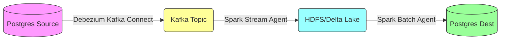

# JADC2 Monitoring System

## Overview
The JADC2-inspired Multi-Domain Operations Monitoring System enables real-time command and control (C2), intelligence, surveillance, reconnaissance (ISR), and logistics across land, sea, air, space, and cyber domains. It uses a `medallion architecture` (Bronze, Silver, Gold) to process data from PostgreSQL to MinIO (Iceberg), ClickHouse, and end-user applications (MCP chatbot, Superset).

## Data Pipeline

- **PostgreSQL**: Data source with Bronze schema, populated by `data_generator`.
- **Debezium**: Streams changes (CDC) from PostgreSQL to Kafka.
- **Kafka**: Queues real-time data.
- **Flink**: Processes Kafka data into MinIO (Iceberg) Bronze tables.
- **MinIO (Iceberg)**: Stores `Bronze` (raw), `Silver` (cleaned), and `Gold` (analytics-ready) layers, transformed via DBT/Dremio/Airflow.
- **ClickHouse**: Imports Gold layer data for OLAP queries.
- **Chatbot/Superset**: Supports MCP chatbot queries and data visualization.

## Project Structure

- **postgresql**: Defines Bronze schema and CDC setup for PostgreSQL.
- **data_generator**: Generates synthetic data for Bronze tables.
- **debezium**: Configures CDC to Kafka.
- **flink**: Processes data into MinIO.
- **hms-standalone-s3**: Hive Metastore for Iceberg tables.
- **dbt**: Transforms data in MinIO (Bronze to Silver/Gold) using Dremio.
- **airflow**: Schedules DBT transformation jobs.
- **clickhouse**: OLAP datastore for Gold layer data.
- **chatbot_clickhouse**: Connects ClickHouse to MCP chatbot.
- **superset**: Visualizes data.
- **Medallion_DB_design.md**: Describes medallion architecture.
- **docker-compose.yml**: Orchestrates all services.

## Usage
Run the entire system using Docker Compose:
``` bash 
docker-compose up --build
```

### Makefile - Complete Project Automation
#### 1. Prerequisites (3 commands):
```bash
make check-deps          # Verify Docker/Docker-Compose
make init-env            # Create .env file
make validate-config     # Validate docker-compose.yml
```

#### 2. Build & Deploy (7 commands):
```bash
make build               # Build all images
make build-spark         # Build only Spark
make up                  # Start everything
make up-infra            # Start only infrastructure
make down                # Stop everything
make restart             # Restart all
make restart-spark       # Restart only Spark jobs
```

#### 3. Monitoring (9 commands):
```bash
make status              # Show container status
make health              # Health check all services
make logs                # Show all logs
make logs-spark-ingest   # Spark ingest logs
make logs-spark-process  # Spark process logs
make logs-kafka          # Kafka logs
make logs-debezium       # Debezium logs
make logs-om             # OpenMetadata logs
make logs-data-gen       # Data generator logs
```

#### 4. Spark Operations (3 commands):
```bash
make spark-submit-ingest  # Submit ingest job
make spark-submit-process # Submit process job
make spark-ui             # Open Spark UI
```

#### 5. Kafka Operations (4 commands):
```bash
make kafka-topics         # List topics
make kafka-create-topics  # Create necessary topics
make kafka-consumer       # Interactive consumer
make kafka-ui             # Open Kafka UI
```

#### 6. HDFS Operations (5 commands):
```bash
make hdfs-info            # Show HDFS report
make hdfs-browse          # Browse directories
make hdfs-safemode-off    # Force out of safe mode
make hdfs-format          # Format HDFS (DANGER!)
make hdfs-ui              # Open HDFS UI
```

#### 7. Database CLI (3 commands):
```bash
make postgres-source-cli  # Connect to source DB
make postgres-dest-cli    # Connect to dest DB
make postgres-hms-cli     # Connect to HMS DB
```

#### 8. OpenMetadata (4 commands):
```bash
make om-status            # Check OM status
make om-token             # Fetch JWT token
make om-ingest-all        # Run ingestion (via UI)
make om-ui                # Open OM UI
```

#### 9. Debezium CDC (3 commands):
```bash
make debezium-register    # Register connector
make debezium-status      # Check status
make debezium-delete      # Delete connector
```

#### 10. Data Generator (3 commands):
```bash
make data-generator-start # Start generator
make data-generator-stop  # Stop generator
make data-generator-logs  # Show logs
```

#### 11. Cleanup (2 commands):
```bash
make clean                # Remove stopped containers
make purge                # FULL WIPE (DANGER!)
```

#### 12. Backup & Restore (2 commands):
```bash
make backup-postgres      # Backup both DBs
make backup-hdfs          # Backup HDFS data
```

#### 13. Testing & Docs (2 commands):
```bash
make test-connections     # Test all services
make docs                 # Show documentation links
```

#### 14. Quick Start Example:
```bash
# Initial setup
make check-deps
make init-env
make build

# Start system
make up

# Monitor health
make health

# Check logs
make logs-spark-ingest

# Access services
make om-ui
make spark-ui
make hdfs-ui

# Cleanup
make down
```

## Validate data:

- **PostgreSQL**: `SELECT COUNT(*) FROM bronze.detections_raw;`
- **ClickHouse**: `SELECT * FROM gold_threats WHERE threat_level = 'critical';`

## Notes

- Use Docker secrets for sensitive credentials (e.g., `DB_PASSWORD`).
- See each folder's `README.md` for service-specific details.
- Refer to `./medallion_DB_design.md` for Bronze, Silver, Gold layer design.




